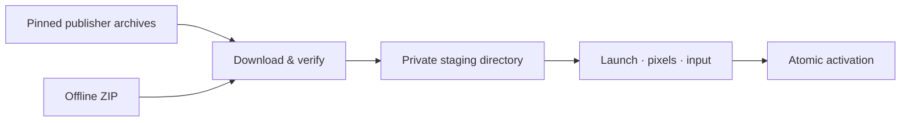

<div align="center">

# Floe Native Apps

**A private graphical runtime for applications on your Linux host.**

Prepare Xpra, a headless X server, and their native dependencies through one Go API.
Keep applications on the host, with their own files, identity, and permissions.

[](https://github.com/floegence/floe-native-apps/actions/workflows/ci.yml)
[](https://github.com/floegence/floe-native-apps/actions/workflows/codeql.yml)
[](https://pkg.go.dev/github.com/floegence/floe-native-apps)
[](LICENSE)

[Get started](#get-started) · [Integration](#integration-contract) · [Platforms](#platforms-and-requirements) · [Contributing](CONTRIBUTING.md) · [Security](SECURITY.md)

</div>

## What it does

Floe Native Apps supplies the optional native graphics layer behind a host
application launcher. A server can start without a desktop environment or a
monitor. The SDK acquires a pinned component set into a private directory,
verifies it, and proves that it can render a window, receive input, and retain
the same application across WebSocket viewer disconnects before
making it available to the product.

- **Private installation:** no root password, system package installation,
  global loader configuration, or changes to the host's software sources.
- **Verified acquisition:** exact archive sizes and SHA-256 digests, bounded
  extraction, contained links, and atomic activation after a graphical check.
- **Recoverable preparation:** observable progress, owner-scoped cancellation,
  idempotent requests, explicit interruption after restart, and offline delivery.
- **Native execution:** the user's applications run directly on Linux. No
  production container or virtual machine sits between the application and host.

This is an embeddable preparation SDK. The consuming product supplies the app
catalog, authorization, session lifecycle, viewer, and user interface.
[Redeven](https://github.com/floegence/redeven) is one consumer.



## Get started

Use **Go 1.27.1**, aligned with Redeven. Install the released module:

```sh
go get github.com/floegence/floe-native-apps@v0.2.2
```

Select a supported package and create one long-lived manager for an absolute,
private state directory. Construction does not download or execute components.
Start preparation only after the host product admits the user's action.

```go
pkg, err := nativeapps.NativePackage()
if err != nil {
    return err // Unsupported hosts must not offer Linux preparation.
}
manager, err := nativeapps.New(stateRoot, pkg, nil)
if err != nil {
    return err
}
defer manager.Close()

// Derive owner from the authenticated session. Retain requestID across retries.
status, err := manager.Start(owner, requestID, "download", 0)
if err != nil {
    return err
}
_ = status // Observe progress with Watch and Snapshot until ready or failure.
```

Import the package as
`nativeapps "github.com/floegence/floe-native-apps"`.
The [compiling lifecycle example](example_test.go) demonstrates subscription,
terminal states, context cancellation, and tool resolution. In a service, keep
the manager alive across HTTP requests; closing it cancels active preparation.

To try the standalone qualification tool **on a Linux host**:

```sh
go run ./cmd/floe-native-apps -state "$HOME/.local/share/floe-native-apps"
```

The command reports JSON progress, performs the real graphical check, and prints
the installed directory when ready. It prepares components; it does not expose
a remote desktop or launch a user's application.

## Integration contract

| Owner | Responsibilities |
| --- | --- |
| This SDK | Fixed catalog, downloads, verification, extraction, private support environment, durable preparation, graphical self-check |
| Host product | User admission, authentication, state-directory ownership, application metadata, private display/session, application launch, viewer and window lifetime |
| Operating system | Process identity, filesystem permissions, network policy, executable mounts, and security policy |

**Observe current state.** `Watch` provides coalesced invalidations, not an event
log. Subscribe, read `Snapshot(owner)`, and read it again after each notification.
Unsubscribing or losing an observer does not cancel preparation. `ready` permits
`Directory` and `ResolveTools`; `failed`, `cancelled`, and `interrupted` require
an explicit new user action to retry. No partial installation is activated.

**Preserve request identity.** Retry an uncertain `Start` response with the same
owner, request ID, source, and upload size. A competing operation returns
`ErrBusy`. Only the authenticated operation owner may upload or cancel. The
consumer must authorize reads and writes before calling the SDK; an owner string
is an identity binding, not an authentication mechanism.

**Keep support libraries out of host applications.** Use the complete toolset
from `ResolveTools` and `Tools.Environment` for support processes. Before a GIO
launch, restore the saved `FLOE_NATIVE_APPLICATION_ENV` map onto the application's
launch context and remove that variable and `FLOE_NATIVE_ROOT`. Retain the
session's private display and D-Bus addresses. Never export the private loader
path to user applications or substitute the support Python for their interpreter.

**Keep the trust boundary closed.** Use the checked-in catalog selected through
`NativePackage` or `ForPlatform`. Do not accept executable paths, artifact URLs,
hashes, custom catalogs, or package identities from renderer/client input. Pass
`nil` as the validator to retain the built-in graphical check. A custom validator
is a trusted host integration hook, not a client option.

**Disable unused audio completely.** Append `XpraNoAudioArgs()` when starting a
silent Xpra 6.x graphics session. It disables the audio subsystem, PulseAudio,
speaker, and microphone support. `--speaker=off` and `--microphone=off` only start
muted; they still initialize audio codecs and can make every window inventory
query wait five seconds when an audio backend is unavailable. The graphical
self-check uses the same options and requires two inventory queries to complete
within three seconds each, in addition to proving decoded pixels and input.
Consumers retain their own authentication, private display, process lifetime,
transport, and actual-window readiness checks.

## Offline delivery

Hosts that supply another reviewed archive catalog can use the public
`github.com/floegence/floe-native-apps/artifactcache` package. This is the same
acquisition implementation used by native component preparation and offline
bundles. It downloads original publisher bytes without extracting or executing
them, independently of the downloading machine's OS and architecture.

```go
result, err := artifactcache.Acquire(ctx, privateCacheDirectory, artifactcache.Spec{
    URL: pinnedPublisherURL,
    SHA256: pinnedSHA256,
    SizeBytes: pinnedSize,
}, artifactcache.Options{
    OnProgress: func(p artifactcache.Progress) error {
        // Absolute byte counts; checking, downloading, or verifying.
        return report(p)
    },
})
// Use result.Path only after success. result.FromCache identifies a verified hit.
```

The host chooses the catalog, absolute private cache directory and user consent
before calling `Acquire`; renderer-supplied URLs, digests and paths are not a
trusted catalog. Cache filenames are exact SHA-256 digests. Every reuse checks
length and digest without network access. `Verify` validates an existing regular
file without modifying it; integrity errors match `artifactcache.ErrIntegrity`,
while cancellation and filesystem errors retain their normal classifications.
HTTP redirects cannot downgrade HTTPS. Invalid or incomplete downloads never
replace a cache entry. Concurrent acquisitions use independent temporary files
and may repeat a download; cancellation removes only the current call's staging
file. The host owns cache retention and must not remove entries while readers use
them. This API grants neither permission to install nor to execute an archive.

Acquire original publisher archives on Linux, macOS, or Windows for a Linux
target. Acquisition does not execute those components on the downloading machine.

```sh
go run ./cmd/floe-native-apps \
  -arch arm64 \
  -state /absolute/private/cache \
  -bundle /absolute/native-arm64.zip
```

On the receiving host:

1. Call `Start(owner, requestID, "upload", actualZIPSize)`.
2. Send ordered chunks of at most **256 KiB** through `WriteChunk` using the
   returned operation ID. An identical replay is accepted; gaps and conflicting
   replays are rejected. Resume an interrupted connection from `ReceivedBytes`.
3. Call `CompleteUpload`. The host verifies every original archive and performs
   the same installation and graphical qualification as a direct download.

A process restart reports an interrupted operation and discards incomplete
staging; begin a new admitted operation. An already activated package remains
available. Redistributing the ZIP carries the components' license obligations.

## Platforms and requirements

| Capability | Platforms |
| --- | --- |
| Install and execute native graphics | Linux `amd64`, Linux `arm64`; glibc and musl hosts |
| Acquire an offline ZIP | Linux, macOS, Windows; portable CLI builds checked for `amd64` and `arm64` |
| macOS application capture and control | Owned by the consuming product's macOS integration |

The pinned stack uses Alpine 3.23 packages, Xpra 6.2.2, and Xpra HTML5 v20. Each
architecture includes its own musl loader and library closure. It does not
replace the host's libc. Applications still use their own installed dependencies.

The host needs an executable writable state filesystem, a compatible Linux
kernel, `/bin/sh` and basic shell utilities, ordinary process/Unix socket
permissions, and access to the catalog's HTTPS publishers (or an offline ZIP).
A physical monitor, desktop session, GPU, and system Xpra installation are not
required. X11 applications are the target; native Wayland-only applications,
GPU/DRM capture, and arbitrary third-party application compatibility are outside
this SDK's guarantee. SELinux, AppArmor, and other host policies remain in force;
a denied operation fails without changing policy or escalating privileges.

### Qualification evidence

The component set shipped since v0.1.2 passed GIO application launch, a live
private D-Bus connection, window discovery, decoded pixels, and input delivery:

| Environment | Architecture | Evidence scope |
| --- | --- | --- |
| Ubuntu 22.04; Debian 11 | arm64; amd64 respectively | Native hosts |
| Debian 13; Alpine 3.23 | amd64 and arm64 | Clean unprivileged userspace fixtures |
| Arch Linux; Rocky Linux 9; AlmaLinux 9; RHEL UBI 9 | amd64 | Clean unprivileged userspace fixtures |

RHEL UBI qualifies the userspace image, not a subscribed RHEL host, its kernel,
or every SELinux policy. The [release qualification workflow](https://github.com/floegence/floe-native-apps/actions/workflows/qualification.yml)
repeats fresh installation on native GitHub Linux runners for both architectures
and runs the clean distribution fixtures. Its logs record the actual images and
results. Containers are test fixtures only.

## Development and maintenance

```sh
./scripts/check.sh
# Network-backed security checks, also scheduled and required for releases:
go tool govulncheck ./...
go tool govulncheck golang.org/x/vuln/cmd/govulncheck github.com/rhysd/actionlint/cmd/actionlint
```

The source gate checks formatting, module tidiness and checksums, vet, race tests,
workflow syntax, Python/shell syntax, and six portable build targets. Tests cover
malicious archives, integrity, ownership, idempotency, cancellation, restart,
persistence failure, and activation. The runtime uses the Go standard library;
`go.mod` and `go.sum` additionally pin maintained development tools and their
transitive dependencies. Native archive integrity is separately pinned in
[`catalog.json`](catalog.json).

CodeQL scans Go, Python, and GitHub Actions daily and on demand with extended
security queries. Dependency vulnerability checks run daily and before release.
Dependabot proposes weekly dependency and action updates; updates require review
and passing checks. See [CONTRIBUTING.md](CONTRIBUTING.md) for release criteria,
platform qualification, catalog changes, and commit attribution.

## License and security

The Go SDK, installer, and repository code are [MIT-licensed](LICENSE).
Downloaded components retain their original licenses; each catalog entry records
its publisher URL, SHA-256, license, and source location. This repository releases
source and a catalog, not a combined third-party binary distribution. If you
redistribute archives or an installed stack, satisfy the relevant licenses,
including applicable source availability obligations. Retained original license
files and catalog metadata are evidence, not a substitute for those obligations.

Report vulnerabilities through [GitHub's private reporting form](https://github.com/floegence/floe-native-apps/security/advisories/new).
See [SECURITY.md](SECURITY.md) for the security boundary and supported versions.
